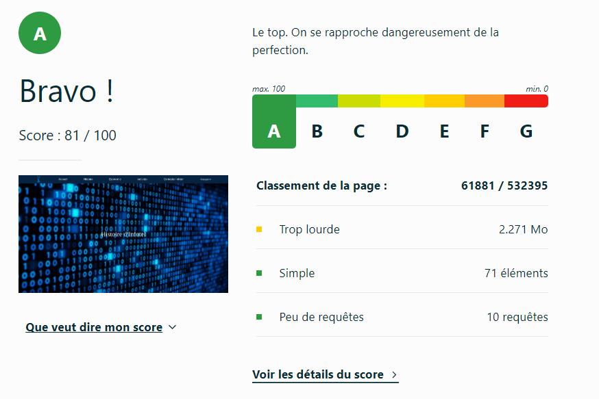
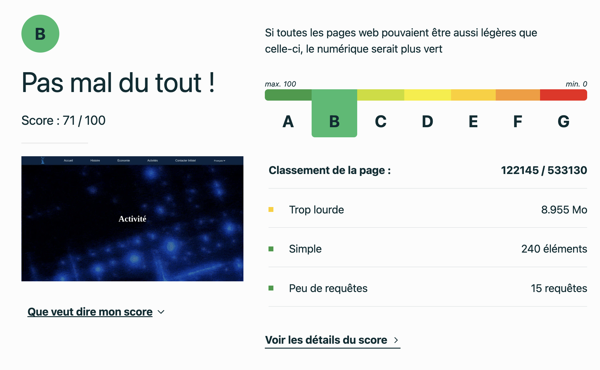

# Présentation d'Infotel  

## Sujet    

[Site de présentation d'Infotel](https://dlugbull.github.io/SAE1-05.06-Infotel/)

## Membres du groupe :

Etudiant 1 (référent du groupe) :  [LUGBULL Damien](mailto:damien.lugbull@edu.univ-fcomte.fr?subject=SAE_1_05_06)  
Etudiant 2 : [MARTINS Cristiano](mailto:critiano.martins@edu.univ-fcomte.fr?subject=SAE_1_05_06)   
Etudiant 3 : [LIEGEON Gabriel](mailto:gabriel.liegeon@edu.univ-fcomte.fr?subject=SAE_1_05_06)  
Etudiant 4 : [MECENERO--CHRETIEN Antoine](mailto:antoine.mecenero-chretien@edu.univ-fcomte.fr?subject=SAE_1_05_06)

## Présentation du projet
Ce dépôt correspond à un site web créé en HTML/CSS/JS dans le cadre de la SAÉ 05-06 à l'IUT de Belfort-Montbéliard.

Ce site a pour objectif de présenter Infotel, une entreprise de développement logiciel.

À travers différentes pages, nous explorons l’histoire de l'entreprise, ses logiciels, et son économie.

Le but est de faire connaitre l'expertise unique d'Infotel et d’offrir aux visiteurs une vue d'ensemble de son évolution et de ses réalisations.

## Choix de conception
Pour la conception du site, nous nous sommes inspirés des sites d'Infotel, d'Asobo Studio et de Ledger.

## Développement site web et validation des pages
<strong>Page d'accueil 
Auteur : LUGBULL Damien</strong> 
Vérification W3C :

https://validator.w3.org/nu/?<a href="https://validator.w3.org/nu/?doc=https%3A%2F%2Fdlugbull.github.io%2FSAE1-05.06-Infotel%2Fhistoire%2Fhistoire.html](https://validator.w3.org/nu/?doc=https%3A%2F%2Fdlugbull.github.io%2FSAE1-05.06-Infotel%2F">

https://www.ecoindex.fr<a href="https://www.ecoindex.fr/resultat/?id=74bf3a1f-14de-43f5-acdb-547695b6b0e7](https://www.ecoindex.fr/resultat/?id=103f60c5-605f-4ada-ba30-ecd50579086c">

  
<strong>Page histoire 
Auteur : MECENERO--CHRETIEN Antoine</strong> 
Vérification W3C :

https://validator.w3.org/nu/?<a href="https://validator.w3.org/nu/?doc=https%3A%2F%2Fdlugbull.github.io%2FSAE1-05.06-Infotel%2Fhistoire%2Fhistoire.html">

https://www.ecoindex.fr<a href="https://www.ecoindex.fr/resultat/?id=74bf3a1f-14de-43f5-acdb-547695b6b0e7">

  
<strong>Page économie 
Auteur : LIEGEON Gabriel</strong> 
Vérification W3C :

  
<strong>Page activités 
Auteur : MARTINS Cristiano</strong> 
Vérification W3C :

<a href="showsource=yes&showoutline=yes&showimagereport=yes&doc=https%3A%2F%2Fdlugbull.github.io%2FSAE1-05.06-Infotel%2Factivites%2Factivites.html">

<a href="https://www.ecoindex.fr/resultat/?id=2c6ecfa8-b1e1-405a-a685-3fd43fcaf928">
